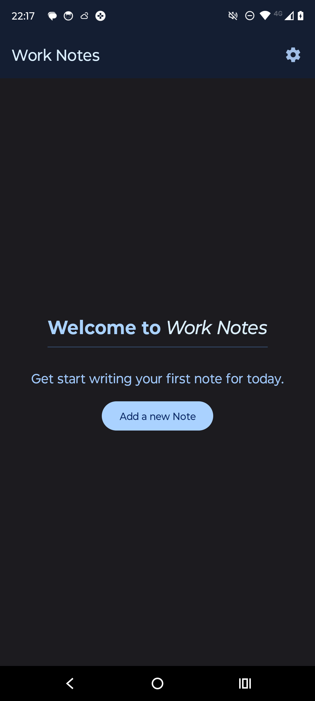
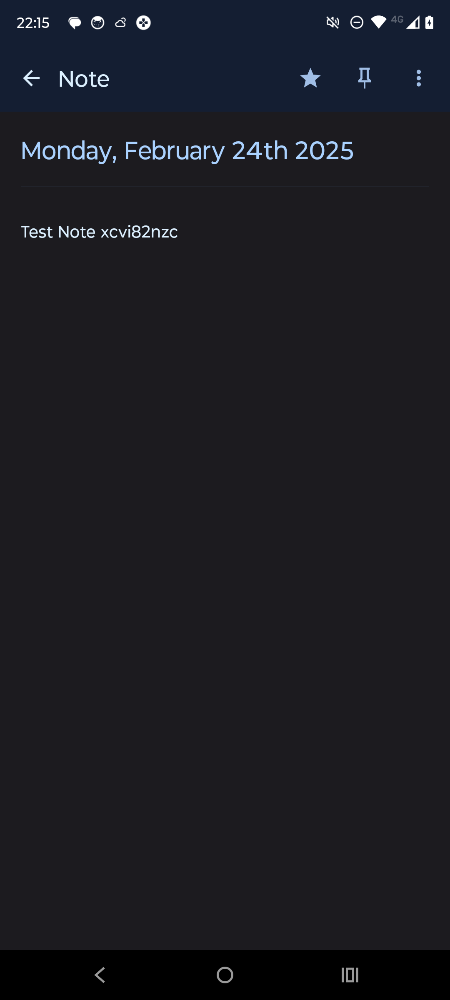
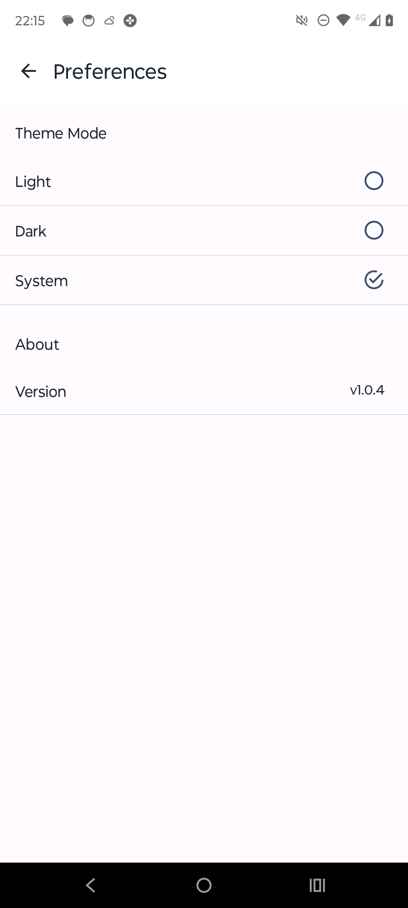

# Work-Notes
### Your Simple Daily Companion

Work-Notes is a lightweight and intuitive mobile application designed to streamline your daily meeting tracking and note-taking process.

## Features

- **Effortless Note-Taking:** Seamlessly record your daily meetings, tasks, and thoughts with ease.
- **Date Tracking:** Automatically saves the date of each note, helping you stay organized and easily reference past entries.
- **Local Storage:** Your data stays securely stored on your device, ensuring privacy and confidentiality.
- **Intuitive Interface:** Simple and user-friendly design makes navigating and using the app a breeze.
- **Customization:** Tailor your notes with customizable options to suit your preferences and needs.
- **Offline Access:** Access and update your notes even when you're offline, ensuring uninterrupted productivity.

## Screenshot Gallery

|  |  |
|----------------------------|-----------------------------|
| Home (Dark) | Home (Light) |

|  |  |
|-----------------------------------------|----------------------------------------|
| Home Empty (Light) | Home Empty (Dark) |

|  |  |
|--------------------------|--------------------------|
| New (Dark) | New (Light) |

|  |  |
|----------------------------|-----------------------------|
| Note (Dark) | Note (Light) |

|  |  |
|--------------------------------------|-------------------------------------|
| Settings (Light) | Settings (Dark) |

## Privacy Policy

At Work-Notes, we prioritize the privacy and security of our users' data. This Privacy Policy outlines how we collect, use, and safeguard your information:

- **Data Collection:** Work-Notes doesn't collect any information from the user, except the notes and associated dates entered by them.
- **Data Storage:** All data entered into Work-Notes is stored locally on your device. We do not transmit or store any user data on external servers or third-party platforms.
- **Data Access:** Work-Notes does not access, share, or sell any user data to third parties. Your information remains solely within your control and is not shared with anyone, including the developers of the application.
- **Security Measures:** We employ robust security measures to protect your data from unauthorized access, alteration, disclosure, or destruction.
- **Consent:** By using Work-Notes, you consent to the collection and use of your data as outlined in this Privacy Policy.
- **Policy Updates:** Work-Notes may update this Privacy Policy periodically. Users will be notified of any changes, and continued use of the app constitutes acceptance of the revised policy.

Your privacy and trust are paramount to us at Work-Notes. We are committed to providing a secure and reliable platform for all your note-taking needs.

## License

[MIT License](LICENSE)
